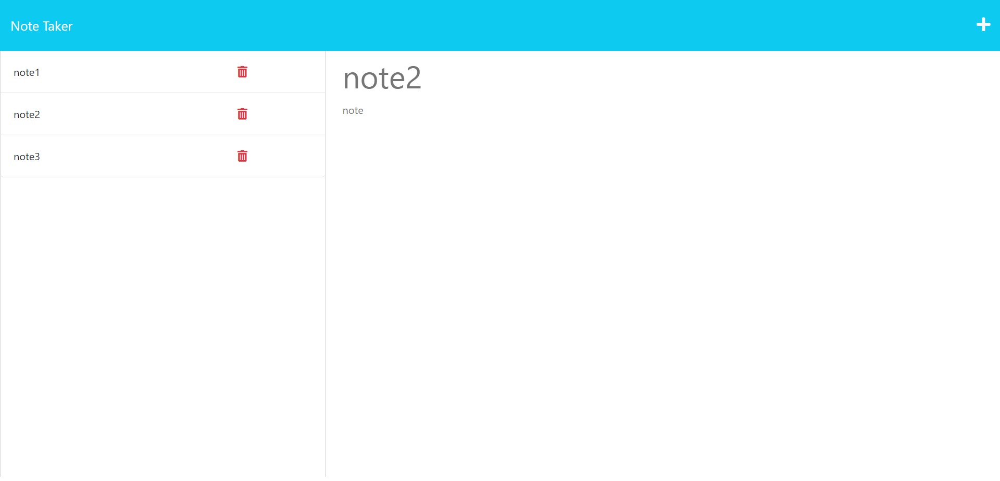

# Note Taker

[](https://opensource.org/license/mit/)

## Description

This is a note taking application. When entering a new note you can save it, and will be displayed on the side column. When clicking an already existing note it will populate in the main area. And clicking the trashcan(delete) deletes the note that is clicked.

---

## Table Of Contents
                             
- [Description](#description)
- [Installation](#installation)
- [Usage](#usage)
- [License](#license)
- [Contributing](#contributing)
- [Tests](#tests)
- [Questions](#questions)

---

## Installation

To install the required dependencies, just run this code: 

```
npm i
```

---

## Usage

Preview of the app:



---

## License

This Project is licenced under MIT license.

---

## Contributing

N/A

---

## Tests

N/A

--- 

## Questions

You can find more about my work at my Github [oliver23n](https://github.com/oliver23n).

## Credits
Base code and front-end developed and provided by COLUMBIA coding bootcamp.
Back-end (server side) code developed by Oliver Nasevski 
